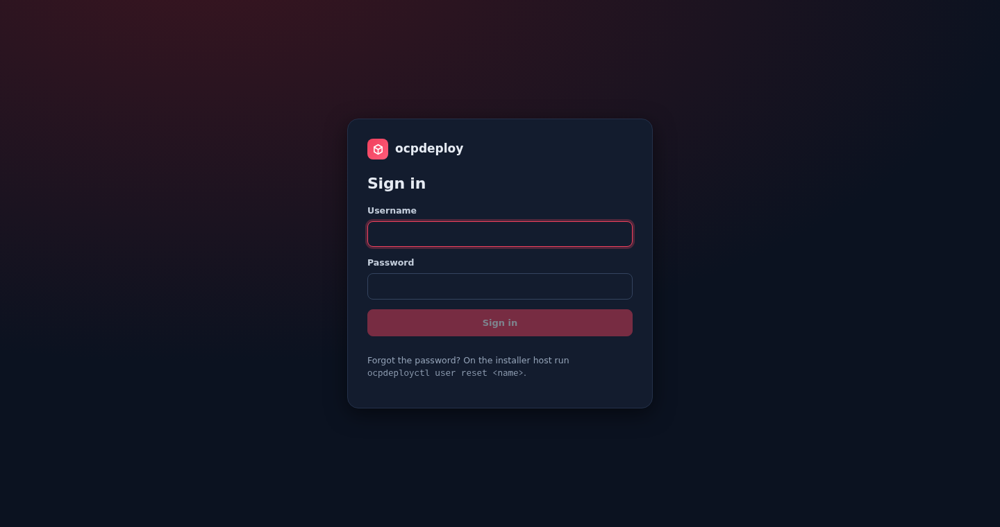
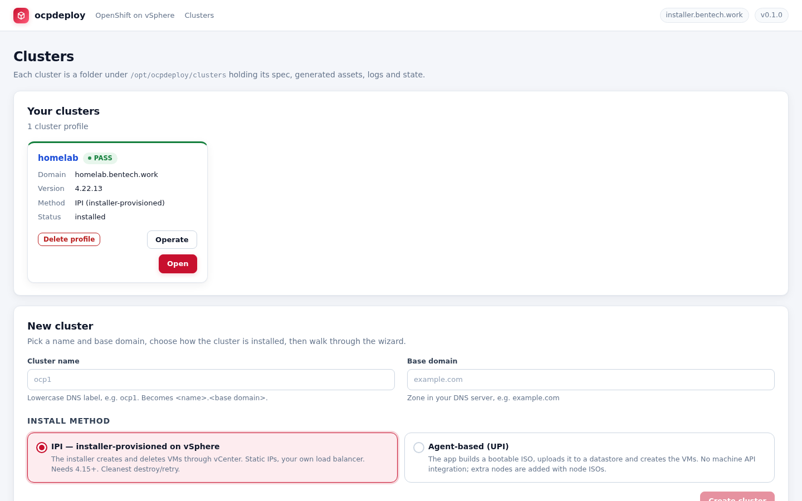
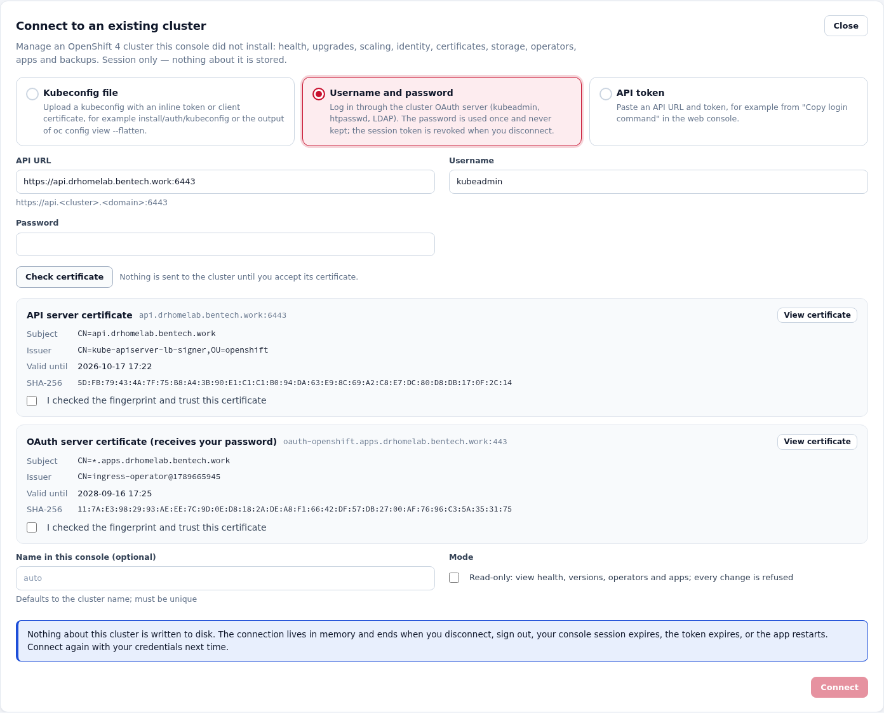
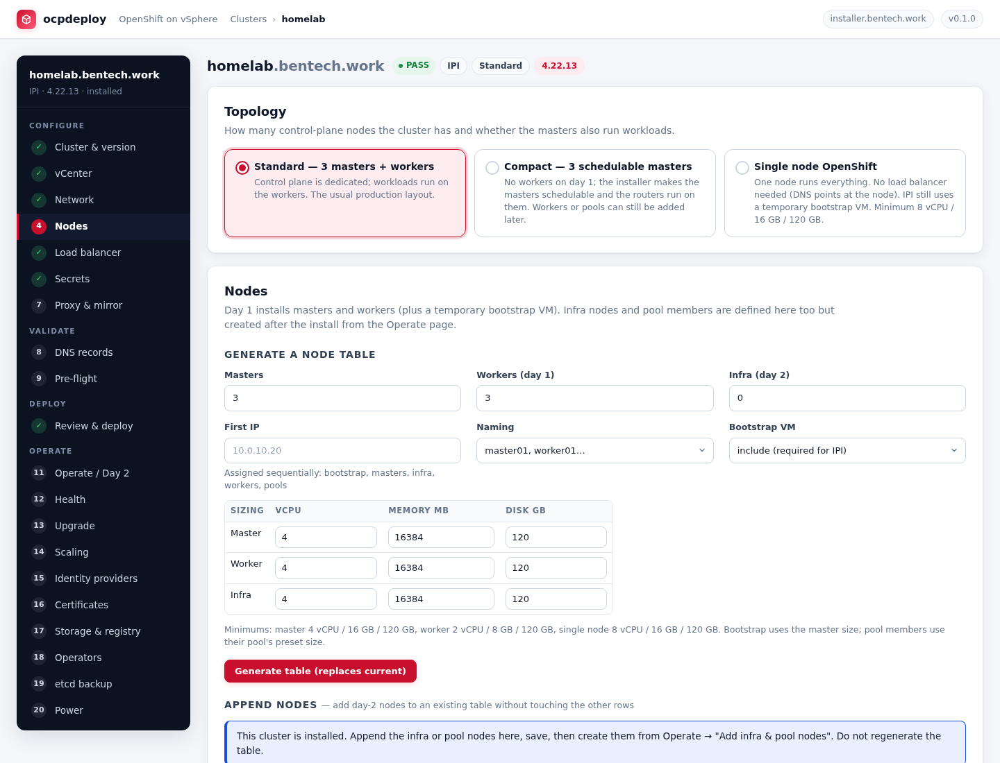
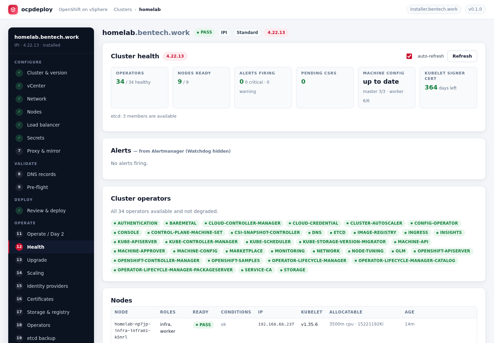
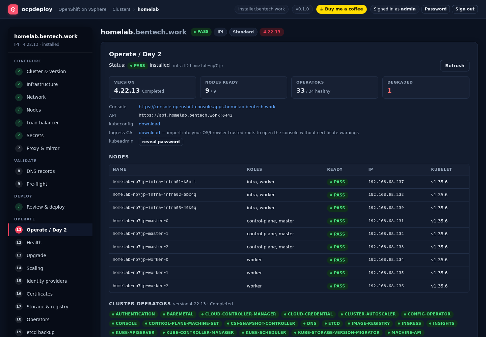

# ocpdeploy

[](https://buymeacoffee.com/bentech4u)

A web console that installs and operates **OpenShift 4 clusters** from a single Linux "installer"
host. It wraps `openshift-install`, talks to vCenter (or Proxmox, KVM, Redfish BMCs) directly,
manages HAProxy load balancers over SSH, validates DNS, and streams every job log live in the
browser. It can also connect to clusters it did not install and run the same day-2 operations on
them. Access is protected by a console login.

Built for home labs and small environments where you have vCenter, your own DNS server and one or
two Linux VMs for HAProxy, and you want repeatable installs without hand-editing YAML.

| | |
|---|---|
|  |  |
| *Console sign-in (dark theme follows the OS).* | *Installed and connected clusters side by side.* |
|  |  |
| *Connecting an existing cluster: both certificates are checked before a password is sent.* | *Nodes step: topology, node table and pools.* |
|  |  |
| *Health of a connected cluster: operators, alerts, CSRs, nodes.* | *Operate / Day 2 for an installed cluster.* |

## Features

* **Wizard per cluster** – cluster & version → infrastructure (vCenter or the agent provider) → network
  → nodes → load balancer → secrets → proxy & mirror → DNS → pre-flight → review & deploy → operate.
* **Topologies** – standard (3 masters + workers), compact three-node (schedulable masters, routers on
  the control plane) and single-node OpenShift (no load balancer needed: DNS points at the node).
* **Failure domains** – several vSphere clusters / datacenters as regions and zones for IPI; nodes can
  be pinned to a domain; the app creates and attaches the `openshift-region` / `openshift-zone` tags.
* **Node pools** – GPU, storage or general worker pools with their own size, labels, taints and extra
  data disks. Members are created on day 2 (one MachineSet per node with its static IP for IPI, node
  ISO for agent installs) so the day-1 install stays uniform.
* **Proxy and disconnected installs** – `proxy:` in install-config, mirror registry with CA and
  `imageDigestSources`, an internal RHCOS OVA URL, and an integrated `oc-mirror --v2` job that mirrors
  the release (plus optional operators and extra images) and records the resulting mappings.
* **Two install methods**
  * *IPI* (installer-provisioned): the installer creates and destroys the VMs; static IPs; your own
    load balancer (`loadBalancer: UserManaged`). Needs OpenShift 4.15+.
  * *Agent-based (UPI)*: the app builds the agent ISO and creates the machines itself (platform
    `none`) on **vSphere, Proxmox VE, KVM/libvirt (over SSH), bare metal through Redfish virtual
    media (iDRAC, iLO, XClarity, Supermicro), or manually** (download the ISO, boot it yourself).
* **Version list from Red Hat's update graph** (stable / fast / candidate), tools downloaded and
  checksum-verified per version.
* **vCenter integration** – certificate captured and accepted by fingerprint (VMCA root pulled from
  the vCenter CA bundle), inventory-driven dropdowns, privilege check, host clock / NTP check.
* **Load balancer**
  * *HAProxy managed by the app*: SSH with password or key to one or two EL9 VMs; installs HAProxy,
    writes `/etc/haproxy/conf.d/ocp-<cluster>.cfg`, validates and reloads. Role-split or keepalived
    HA pair. Unrelated sections in `haproxy.cfg` are preserved.
  * *External*: paste IP + FQDN; the app validates DNS/ports and prints the required backend pools.
* **DNS is validate-only** – a checklist of every required record with hints, checked against your
  DNS server, including stale reverse records.
* **Pre-flight** – host, secrets, node sanity, DNS, LB ports, vCenter objects (or the Proxmox / KVM /
  Redfish provider), capacity, privileges, region/zone tags, proxy and mirror registry.
* **Live deploy log**, installer runs as a transient systemd unit and survives app restarts.
* **Day 2** – credentials & ingress CA download, node/operator dashboard, remove bootstrap from the
  LB, add infra and pool nodes (static IPs), move ingress / monitoring / registry to infra, resume an
  interrupted install, destroy.
* **Operate pages**
  * *Health* – operators, nodes and conditions, machine config pools, pending CSRs (approve), alerts
    from Alertmanager, warning events, etcd, kubelet signer expiry.
  * *Upgrade* – channels and available updates from the CVO, admin-gate acknowledgement, upgrade job
    that follows progress to completion (explicit release image on disconnected clusters).
  * *Scaling* – MachineSets and Machines; scale up with static IPs (the app binds the new IP claims),
    remove machines or app-created MachineSets; HAProxy pools follow.
  * *Identity providers* – htpasswd users (bcrypt), LDAP / AD, OpenID Connect, cluster-admin binding,
    kubeadmin removal with safety checks.
  * *Certificates* – custom API / ingress certificates with CA trust, or Let's Encrypt through the
    cert-manager operator with DNS-01 (Cloudflare, Route 53, RFC 2136).
  * *Storage & registry* – default storage class, NFS provisioner, LVM Storage, ODF internal mode,
    image registry storage (PVC / emptyDir / removed).
  * *Operators* – curated OLM installs (Virtualization, Logging, GitOps, Pipelines, cert-manager,
    NMState, LSO, ODF, LVMS, NFD, NVIDIA GPU, Web Terminal) and mirror catalog resources.
  * *etcd backup* – on demand or on a systemd timer, tarballs kept on the installer host.
  * *Power* – graceful shutdown (backup, workers then masters via VMware Tools) and startup with
    CSR approval.
  * *Applications* – one-click lab workloads in their own namespaces with Routes and generated
    credentials: Gitea, MinIO, Grafana (wired to the cluster Prometheus with a cluster dashboard),
    Keycloak (Red Hat build, via its operator, with PostgreSQL) and Harbor (official Helm chart).
* **Cluster templates** – export any cluster as YAML (runtime state, MACs and BMC details stripped;
  secrets optional), keep a template library on the installer host, and create the next cluster
  from a template or by cloning an existing one with a new name, domain and node IP range.
* **Add Extra nodes** (connected clusters, OpenShift 4.17+) – add bare-metal or other machines with
  `oc adm node-image`: describe hosts with static IPs (or paste NMState / a full `nodes-config.yaml`),
  build one node ISO for all of them, download it and boot the machines, watch validations and
  progress with `oc adm node-image monitor`, approve each node's certificate requests with a button
  (only requests from the listed hosts are shown), and add role labels. Uses the cluster's own pull
  secret and mirror CA, so it works for connected and disconnected clusters alike. The page reads an
  existing worker's install disk, NIC, prefix, gateway and DNS servers as defaults and field hints.
  Pre-checks run before every build and block it on failures: `api-int` (plus `api` and `*.apps`)
  must resolve through the hosts' DNS servers, the machine config server (22623) and API (6443) must
  answer, IPs must be free, unique, inside the machine network and not an API/ingress address,
  hostnames must not clash with existing nodes; missing or stale forward/reverse records are warnings.
* **Connected clusters** – manage an existing OpenShift 4 cluster this console did not install, by
  kubeconfig, username and password (OAuth login) or API token. You accept the API (and OAuth)
  certificate by fingerprint first, with a show/hide certificate viewer. Health, upgrades, scaling,
  identity, certificates, storage, operators, apps and backups work on it; an optional read-only
  mode refuses every change. Nothing about a connected cluster is written to disk (see Security).
* **Console login** – the first visit asks for an administrator account with a strong password;
  accounts are managed with `ocpdeployctl user set|reset|delete|list`.
* Secrets (vCenter password, SSH passwords, pull secret) are encrypted at rest.

## Requirements

* Installer host: RHEL / Rocky / Alma **9**, root access, outbound HTTPS to
  `mirror.openshift.com`, `quay.io`, `registry.redhat.io`, `api.openshift.com`, `pypi.org`,
  `registry.npmjs.org`. 4 vCPU / 8 GB / 50 GB is plenty.
* vCenter 7 or 8 with the ESXi host(s) **inside a cluster object** (IPI refuses standalone hosts),
  a datastore, a port group, and an account with the privileges the installer documents.
  Agent-based installs can use Proxmox VE (API token), a KVM host (SSH, libvirt + virt-install,
  a bridge on the node network), Redfish-capable servers (virtual media licence where the vendor
  needs one; the BMCs must reach this app over HTTP), or any machine you boot by hand.
* A DNS server you control for `api`, `api-int`, `*.apps` and (recommended) the node names.
* One or two EL9 VMs for HAProxy, or an external load balancer.
* A Red Hat pull secret (console.redhat.com/openshift/install/pull-secret).
* NTP on the ESXi hosts. VMs take the host clock at boot.

## Install

```bash
git clone https://github.com/bentech4u/ocpdeploy.git /opt/ocpdeploy
/opt/ocpdeploy/install.sh
```

Then open `http://<installer-host>:8080/`. Set `OCPDEPLOY_PORT` before running the script for a
different port. `OCPDEPLOY_STATIC_DIR` points the backend at a different UI build (used for testing).

The script installs Python 3.12 and Node 22 from AppStream, creates a venv, builds the frontend,
generates an SSH key for root if none exists, and enables the `ocpdeploy` systemd service.

The first visit asks you to create the administrator account. To close that window right after
installing, create it on the host instead:

```bash
ocpdeployctl user set admin
```

## Security

* **Console accounts** live in `users.json` (bcrypt hashes, mode 600). Passwords need at least 12
  characters, three of lowercase/uppercase/digit/symbol, and must not contain the username.
  Sessions are HttpOnly, SameSite=Strict cookies held in memory: they end after 4 idle hours,
  24 hours at most, on sign-out, on a password change, and when the app restarts. Five failed
  logins from one address lock it out for five minutes.
* **Account management** on the installer host (works while the app runs; changing or deleting
  an account signs its sessions out):

  ```bash
  ocpdeployctl user list
  ocpdeployctl user set <name>        # create, or set a password
  ocpdeployctl user reset <name>      # change the password of an existing account
  ocpdeployctl user delete <name>
  ```

  Add `--password-stdin` to read the password from standard input.
* **Connected clusters are RAM only.** The kubeconfig built for the session sits in a mode-700 tmpfs
  directory (`/dev/shm/ocpdeploy-imported`, wiped at every start), `oc` caches go there too, and the
  connection is dropped on disconnect, sign-out, session or token expiry, and restart. Passwords are
  used once for the OAuth login and never kept; that login token is revoked on disconnect (tokens
  you paste yourself are left alone). Uploaded kubeconfigs may only carry inline tokens or client
  certificates: exec plugins, auth providers and file references are refused because they would
  run programs or read files on the installer host. Connected clusters cannot be cloned or saved as
  templates. The one exception is **Add Extra nodes**: the node ISO (about 1.4 GB, containing the
  cluster's join details) is written to `work/<cluster>-<timestamp>/` (mode 700, file mode 600) and
  kept until you press **Delete ISO**, so it can still be downloaded after the connection ends. The
  pull secret used to build it stays in memory. Temporary `openshift-node-joiner-*` namespaces the
  build or monitor leave behind when stopped are removed by the job.
* **Certificate pinning.** The API (and OAuth) certificate you accept is checked again when the
  connection is made; a different certificate is refused.
* **ISO downloads** for Redfish virtual media use a per-cluster secret URL
  (`/api/iso/<cluster>/<token>/<file>`), since BMCs cannot log in; every other endpoint needs a
  session.
* The console speaks plain HTTP. Put it behind a TLS reverse proxy (or keep it on a management
  network) so passwords and cluster credentials do not cross the network in clear text.

## Layout

```
backend/ocpdeploy/     FastAPI app (routers/, services/, templates/)
ui/                    React + Vite frontend, built into backend/ocpdeploy/static
clusters/<name>/       per-cluster state (git-ignored)
  cluster.json         spec, secrets encrypted with .secret_key
  state.sqlite         jobs, logs, check results
  install/             openshift-install working dir (auth/kubeconfig, auth/kubeadmin-password)
  mirror/              imageset-config.yaml, oc-mirror workspace and cache (disconnected installs)
  backups/             etcd snapshots (etcd-<timestamp>.tar.gz)
  logs/                installer log copies, job outputs
bin/<version>/         openshift-install, oc (git-ignored)
templates/             cluster templates saved from the UI (git-ignored)
users.json             console accounts, bcrypt hashes (git-ignored)
work/                  node ISOs from Add Extra nodes, kept until deleted (git-ignored)
ocpdeployctl           command line: accounts, backups (linked to /usr/local/bin by install.sh)
install.sh             installer for a new host
ocpdeploy.service      systemd unit
```

## Operating

```bash
systemctl status ocpdeploy
systemctl restart ocpdeploy        # safe during a deploy; the job is re-attached
journalctl -u ocpdeploy -f
```

Moving to another host: copy the whole directory including `clusters/` and `.secret_key`, then run
`install.sh` there.

## Development

```bash
PYTHONPATH=backend .venv/bin/uvicorn ocpdeploy.main:app --reload --port 8080
cd ui && npm run dev           # dev server proxies /api to :8080
cd ui && npm run build         # rebuild the static bundle
```

## Notes learned the hard way

* `openshift-install` validates the vCenter certificate against the **installer host's trust
  store**, not `additionalTrustBundle`. The app passes a combined bundle via `SSL_CERT_FILE`.
* IPI needs `/DC/host/<cluster>`; a standalone ESXi host path fails with "cluster not found".
* Slow image pulls on the bootstrap node can exhaust the installer's 15-minute provisioning window.
  Nothing is lost: use *Resume interrupted install* on the Operate page.
* Browser warnings on the console are expected; import the ingress CA from the Operate page.
* A VM that powers on but never reports an IP to vCenter almost always sits on the wrong port group.
  Check the network chosen in the vCenter step against the machine network VLAN.
* Disconnected: the pull secret must also carry the mirror registry login, and `oc-mirror` runs on the
  installer host, which needs internet access (directly or through the proxy) while mirroring.
* Data disks on day-2 MachineSets need OpenShift 4.18+; older releases silently ignore them.
* Static-IP clusters keep the installer's worker MachineSet at 0 replicas; the workers are standalone
  Machines. Scaling up creates IPAddressClaims that nothing serves, so the app writes the IPAddress
  objects itself. Removing a worker deletes its Machine (drain + VM destroy).
* Backups and power operations need no SSH key: they go through `oc debug node` and VMware Tools.
* Redfish and manual installs fetch the ISO from `http://<installer-host>:<port>/api/clusters/<name>/iso/…`.
  Set `OCPDEPLOY_ADVERTISE_URL` (or the ISO URL base in the Infrastructure step) when the BMC
  network sees this host under a different address. IPI stays vSphere-only: it is the installer
  that talks to the hypervisor there.
* Harbor runs with the `anyuid` SCC granted to its namespace's default service account (the chart
  pins UID 10000). Grafana, Gitea (rootless image) and MinIO run under the restricted SCC.

## Support

If ocpdeploy saved you an evening of YAML, you can [buy me a coffee](https://buymeacoffee.com/bentech4u).
Issues and pull requests are welcome on GitHub.
